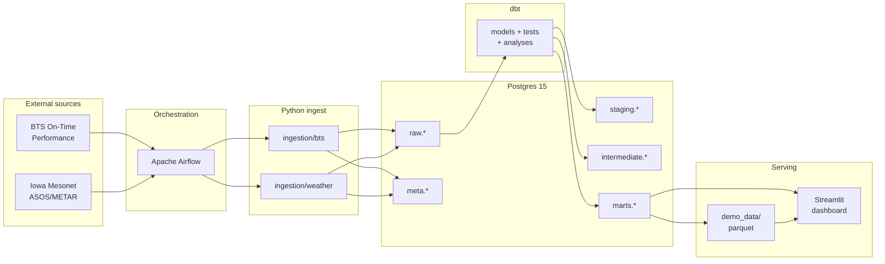

# AeroDelay Intelligence Pipeline

[](https://github.com/rmarathe-hub/aerodelay-intelligence-pipeline/actions/workflows/dbt-ci.yml)
[](https://aerodelay-intelligence-pipeline-882usdpsfau5g7ap6yzktj.streamlit.app/)


Production-style **ELT pipeline** that joins U.S. flight on-time performance with airport weather to analyze **delay risk** across **45 major airports**.

Built with **Airflow · Postgres · dbt · Docker · Streamlit** — **15.7M-flight full marts** (2023–2025) on top of **15.9M flights** and **14.4M weather observations** at raw layer; **409K Jan 2025 sample** for CI and Streamlit Cloud demo.

**→ [Open live dashboard](https://aerodelay-intelligence-pipeline-882usdpsfau5g7ap6yzktj.streamlit.app/)** (Streamlit Community Cloud · parquet demo · no login)  
**→ [dbt docs](https://rmarathe-hub.github.io/aerodelay-intelligence-pipeline/)** (model lineage · Jan 2025 sample catalog)

---

## Live demo

| | |
|---|---|
| **Home** | [aerodelay-intelligence-pipeline.streamlit.app](https://aerodelay-intelligence-pipeline-882usdpsfau5g7ap6yzktj.streamlit.app/) |
| **Airport × Hour** | [Open page →](https://aerodelay-intelligence-pipeline-882usdpsfau5g7ap6yzktj.streamlit.app/Airport_Hour) |
| **Weather Buckets** | [Open page →](https://aerodelay-intelligence-pipeline-882usdpsfau5g7ap6yzktj.streamlit.app/Weather_Buckets) |
| **Carrier Routes** | [Open page →](https://aerodelay-intelligence-pipeline-882usdpsfau5g7ap6yzktj.streamlit.app/Carrier_Routes) |
| **Mode** | Parquet demo — Jan 2025 agg marts, no Postgres required |
| **Local** | `make dashboard` → http://localhost:8501 |

Verified live: executive snapshot (1,000 airport-hour buckets · 6,273 routes), precip lift chart, all three analytic pages load.

---

## Highlights

- **End-to-end ELT** — BTS + Iowa Mesonet ASOS/METAR → raw Postgres → dbt staging/intermediate/marts
- **Weather-at-departure join** — nearest METAR within a time window; **~96% match** on full 2023–2025 marts (**95%** on Jan 2025 sample; HNL deferred — station map issue)
- **Orchestration** — Airflow DAGs for BTS and weather ingest with idempotent loads + `meta.*` audit logs
- **Tested marts** — 33/33 bulletproof checks locally; **GitHub Actions CI** runs the same critical dbt tests on Jan 2025 sample
- **Interactive dashboard** — airport×hour curves, weather buckets, carrier route scatter + leaderboard

---

## Architecture



**Layer summary**

| Layer | Examples | Grain |
|-------|----------|-------|
| **raw** | `bts_flights`, `weather_observations` | Source rows |
| **staging** | `stg_bts__flights`, `stg_weather__observations` | Cleaned, typed |
| **intermediate** | `int_flights__weather_at_departure` | Flight + nearest weather |
| **marts** | `fct_flights`, `agg_delay_by_*` | Analytics-ready facts & aggs |

Deep dive: [`docs/ARCHITECTURE.md`](docs/ARCHITECTURE.md) · join logic: [`docs/weather_join_methodology.md`](docs/weather_join_methodology.md)

---

## Data coverage

| Layer | Scope | Rows |
|-------|-------|------|
| **Raw BTS** | 45 origins · 2023–2025 | **15.9M** |
| **Raw weather** | 45 stations · 36 months | **14.4M** |
| **Full marts** | 2023–2025 (`fct_flights`) | **15,752,377** |
| **Weather match** | Full history (excl. HNL) | **~96%** per month |
| **dbt dev sample** | Jan 2025 (`dev_year_month`) | **409K** flights |
| **Agg marts (demo)** | Jan 2025 parquet / CI | 1K / 634 / 6.3K |

Full materialization: [`docs/LOCAL_FULL_MATERIALIZATION.md`](docs/LOCAL_FULL_MATERIALIZATION.md) · row counts: [`docs/DATA_COVERAGE.md`](docs/DATA_COVERAGE.md)

---

## Dashboard

**Live:** [streamlit.app](https://aerodelay-intelligence-pipeline-882usdpsfau5g7ap6yzktj.streamlit.app/) · **Local:** `make dashboard`

Three analytic views over dbt aggregation marts:

| Page | Question answered | Live link |
|------|-------------------|-----------|
| **Airport × Hour** | When do delays spike by origin and UTC hour? | [View →](https://aerodelay-intelligence-pipeline-882usdpsfau5g7ap6yzktj.streamlit.app/Airport_Hour) |
| **Weather Buckets** | How do wind, precip, and visibility bins affect delay rate? | [View →](https://aerodelay-intelligence-pipeline-882usdpsfau5g7ap6yzktj.streamlit.app/Weather_Buckets) |
| **Carrier Routes** | Which airline routes have highest volume vs delay? | [View →](https://aerodelay-intelligence-pipeline-882usdpsfau5g7ap6yzktj.streamlit.app/Carrier_Routes) |

```bash
make dashboard-deps    # first time
make dashboard         # http://localhost:8501
```

Deploy guide: [`docs/DAY30_CHECKLIST.md`](docs/DAY30_CHECKLIST.md)

---

## Quickstart (local dev)

**Prerequisites:** Docker Desktop, Python 3.11+, ~8 GB RAM recommended

```bash
git clone https://github.com/rmarathe-hub/aerodelay-intelligence-pipeline.git
cd aerodelay-intelligence-pipeline

cp .env.example .env          # set POSTGRES_PASSWORD
make fernet && make up && make check
```

**Ingest samples (optional — raw backfill may already be loaded):**

```bash
make load-bts-sample
make load-weather-sample
```

**Build Jan 2025 dbt sample (~3 min for weather join):**

```bash
bash scripts/dbt_run.sh run \
  --select +int_flights__weather_at_departure fct_flights agg_delay_by_airport_hour agg_delay_by_weather_bucket agg_delay_by_carrier_route \
  --full-refresh --vars '{dev_year_month: "2025-01"}' --threads 1
```

**Validate:**

```bash
make dbt-bulletproof-jan2025   # 33/33 on Jan 2025 sample
make dashboard
```

### Services

| Service | URL |
|---------|-----|
| Postgres | `localhost:5432` / db `aerodelay` |
| Airflow | http://localhost:8080 (`admin` / `admin`) |
| Streamlit | http://localhost:8501 |

---

## Project layout

```
airflow/dags/           ingest_bts, ingest_weather, healthcheck
ingestion/              BTS + weather download/load modules
dbt/                    staging → intermediate → marts + tests
dashboard/              Streamlit app + demo parquet bundle
docker/                 Postgres init, Airflow image
scripts/                dev_up, backfill, dbt wrapper, bulletproof
docs/                   architecture, data dictionary, checklists
```

---

## Key Make targets

| Target | Purpose |
|--------|---------|
| `make up` / `make down` | Start / stop Docker stack |
| `make backfill-bts` | Full BTS raw load (2023–2025) |
| `make backfill-weather` | Full weather raw load (45×36 months) |
| `make materialize-full-local` | Monthly incremental full 2023–2025 marts |
| `make validate-full-materialization` | Row counts, dupes, coverage checks |
| `make dbt-run-marts` | Build marts layer |
| `make dbt-bulletproof-jan2025` | Critical test pass on Jan 2025 (local Docker) |
| `make ci-dbt-test-jan2025` | Same critical tests (Postgres on localhost) |
| `make dashboard` | Run Streamlit locally |
| `make export-dashboard-demo` | Export agg marts → parquet for Cloud |

---

## Data sources

- **[BTS On-Time Performance](https://www.transtats.bts.gov/)** — U.S. DOT monthly carrier reports
- **[Iowa Environmental Mesonet ASOS/METAR](https://mesonet.agron.iastate.edu/)** — airport weather observations

45-airport scope: [`docs/airports_45.csv`](docs/airports_45.csv) · station map: [`docs/airport_station_map.csv`](docs/airport_station_map.csv)

---

## Known limitations

- **HNL weather join** — station map uses `HNL`; IEM data is under `PHNL` (~179K flights, 0% match until map fix)
- **Streamlit Cloud** — Jan 2025 parquet demo only (not full 15.7M marts); set **Python 3.11** in Advanced settings

---

## Documentation

| Doc | Contents |
|-----|----------|
| [**dbt docs (GitHub Pages)**](https://rmarathe-hub.github.io/aerodelay-intelligence-pipeline/) | Model lineage, column descriptions (Jan 2025 catalog) |
| [`docs/ARCHITECTURE.md`](docs/ARCHITECTURE.md) | Pipeline design, schemas, DAG flow |
| [`docs/DATA_COVERAGE.md`](docs/DATA_COVERAGE.md) | Row counts, full marts proof, dev workflow |
| [`docs/LOCAL_FULL_MATERIALIZATION.md`](docs/LOCAL_FULL_MATERIALIZATION.md) | Monthly incremental 2023–2025 build |
| [`docs/data_dictionary.md`](docs/data_dictionary.md) | Column-level reference |
| [`docs/DAY30_CHECKLIST.md`](docs/DAY30_CHECKLIST.md) | Streamlit Cloud deploy |

---

## CI

On every push/PR to `main`, [`.github/workflows/dbt-ci.yml`](.github/workflows/dbt-ci.yml):

1. Starts Postgres 15
2. Downloads & loads **Jan 2025** BTS + weather (45 stations)
3. Runs dbt build with `dev_year_month: "2025-01"`
4. Runs 13 critical dbt tests (same set as bulletproof)

Local repro (Postgres on `localhost:5432` with `.env` credentials):

```bash
make ci-setup-postgres && make ci-load-jan2025 && make ci-dbt-test-jan2025
```

---

## License

MIT — see repository for details.
