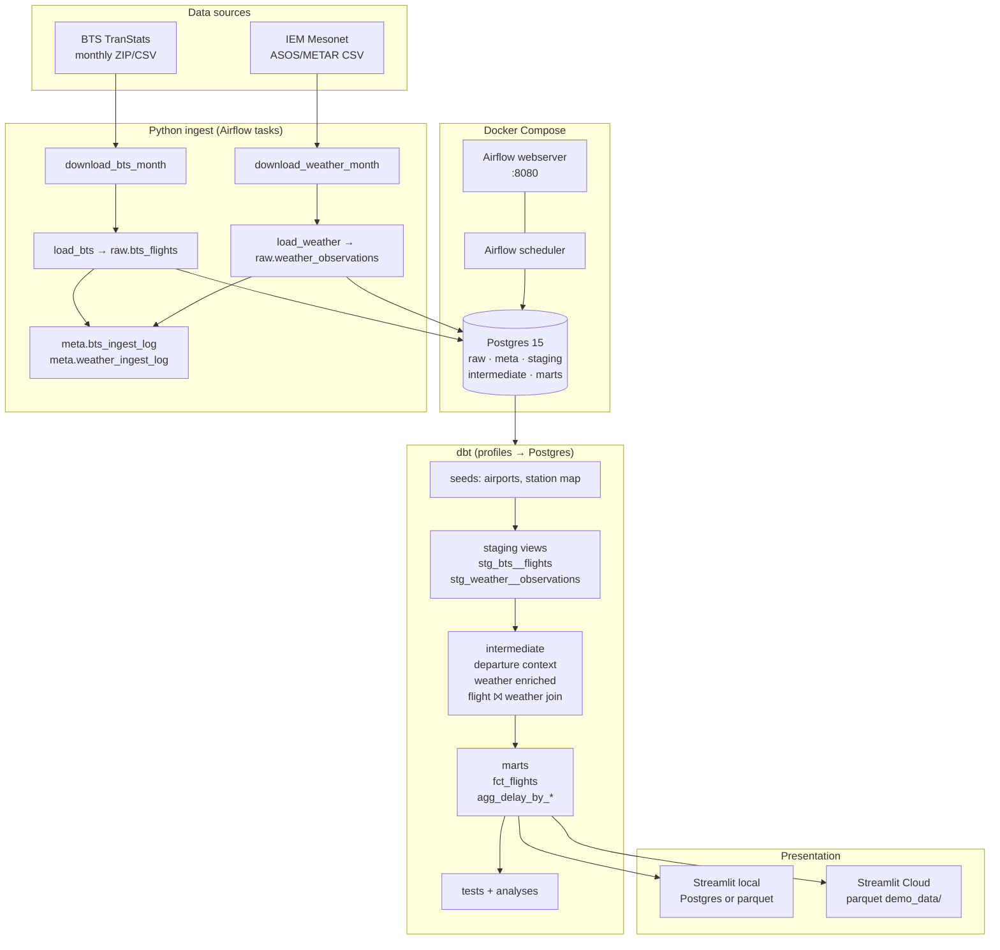
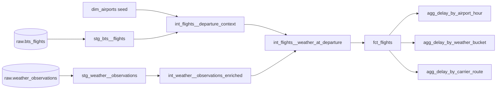
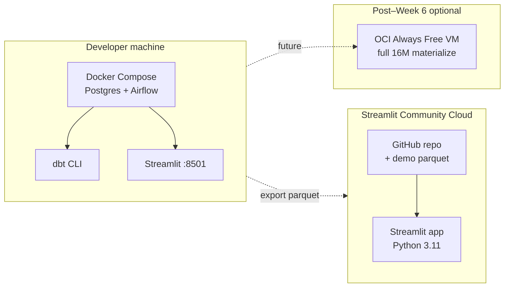

# Architecture — AeroDelay Intelligence Pipeline

Last updated: 2026-06-29 (Week 6)

---

## System overview

AeroDelay is a **local-first ELT stack** that ingests public aviation and weather data, transforms it with **dbt** in **Postgres**, and serves insights through a **Streamlit** dashboard. Airflow orchestrates repeatable ingest; the dashboard can run against Postgres locally or bundled **parquet** on Streamlit Community Cloud.



---

## Component responsibilities

| Component | Role |
|-----------|------|
| **Airflow** | Schedule/trigger ingest DAGs; retry failed months; pause-at-creation for safety |
| **ingestion/** | Download from BTS/IEM, parse CSV, bulk load to Postgres, write audit rows |
| **Postgres** | Single warehouse; schemas separate concerns (raw → marts) |
| **dbt** | SQL transforms, documentation, data tests, ad-hoc analyses |
| **Streamlit** | Multipage dashboard over agg marts; parquet fallback for cloud |
| **scripts/** | Thin wrappers for dev ergonomics (`dbt_run.sh`, `bulletproof_jan2025.sh`) |

---

## Postgres schemas

| Schema | Owner | Contents |
|--------|-------|----------|
| `raw` | Ingest | `bts_flights`, `weather_observations` — append/upsert by ingest |
| `meta` | Ingest | `bts_ingest_log`, `weather_ingest_log` — idempotency & audit |
| `staging` | dbt | Typed views on raw; optional `dev_year_month` filter |
| `intermediate` | dbt | Join prep, weather enrichment, flight–weather join (table on sample) |
| `marts` | dbt | `fct_flights` fact + `agg_delay_by_*` aggregation views/tables |

Init SQL: `docker/postgres/init/`

---

## Ingest flow

### BTS (`airflow/dags/ingest_bts.py`)

1. Download monthly ZIP from TranStats (or read local cache under `data/raw/bts/`)
2. Extract CSV, filter to 45 origin airports
3. Load to `raw.bts_flights` with `(year_month, origin)` dedupe semantics
4. Record row counts in `meta.bts_ingest_log`

Backfill: `make backfill-bts` (36 months, 2023–2025)

### Weather (`airflow/dags/ingest_weather.py`)

1. Map airport → IEM station via `docs/airport_station_map.csv`
2. Download hourly ASOS/METAR CSV per station-month
3. Load to `raw.weather_observations`
4. Index `(station, valid)` for join performance
5. Audit in `meta.weather_ingest_log`

Backfill: `make backfill-weather` (45 stations × 36 months)

---

## dbt model graph (simplified)



### Dev sample filter

Macro `dev_year_month_filter` limits staging (and downstream) to one month for fast iteration:

```bash
--vars '{dev_year_month: "2025-01"}'
```

Always select **parents** (`+model`) so filtered staging propagates.

---

## Weather join (core logic)

Implemented in `intermediate.int_flights__weather_at_departure`:

1. Match `flight.origin` to `weather.airport_code`
2. Find observations within ± window of `dep_time_utc`
3. Pick **nearest** observation (tie-break: before departure preferred)
4. Expose match flags and lag minutes on `marts.fct_flights`

Full spec: [`weather_join_methodology.md`](weather_join_methodology.md)

---

## Dashboard architecture

| Mode | Data path | When |
|------|-----------|------|
| **Local Postgres** | `load_agg_table()` → `marts.agg_*` | Docker up, no parquet |
| **Parquet demo** | `dashboard/demo_data/*.parquet` | Streamlit Cloud, offline |
| **Hybrid** | Parquet preferred if files exist | Default after `make export-dashboard-demo` |

Entry: `dashboard/app.py` · pages: `dashboard/pages/` · bootstrap: `dashboard/bootstrap.py` (Cloud `sys.path` fix)

Export: `make export-dashboard-demo`

---

## Validation strategy

| Scope | Command | Duration |
|-------|---------|----------|
| Jan 2025 bulletproof | `make dbt-bulletproof-jan2025` | ~6s |
| Agg tests only | `dbt test --select agg_delay_by_*` | seconds |
| Full test suite (71 tests) | `make dbt-test` | **avoid on 16M rows locally** |

CI (Week 6 Day 2): GitHub Actions — [`.github/workflows/dbt-ci.yml`](../.github/workflows/dbt-ci.yml) on Jan 2025 sample (~13 critical tests).

---

## Deployment topology



---

## Related docs

- [`DATA_COVERAGE.md`](DATA_COVERAGE.md) — row counts and dev commands
- [`data_dictionary.md`](data_dictionary.md) — column definitions
- [`ingest_issues.md`](ingest_issues.md) — HNL and download notes
